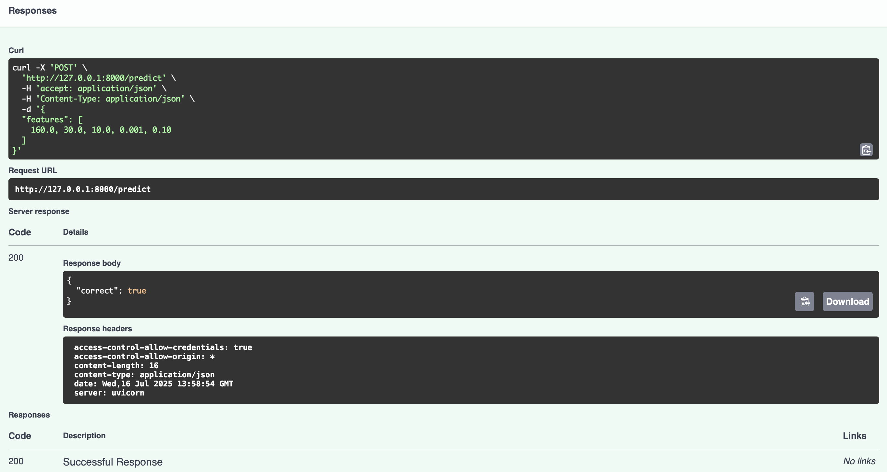
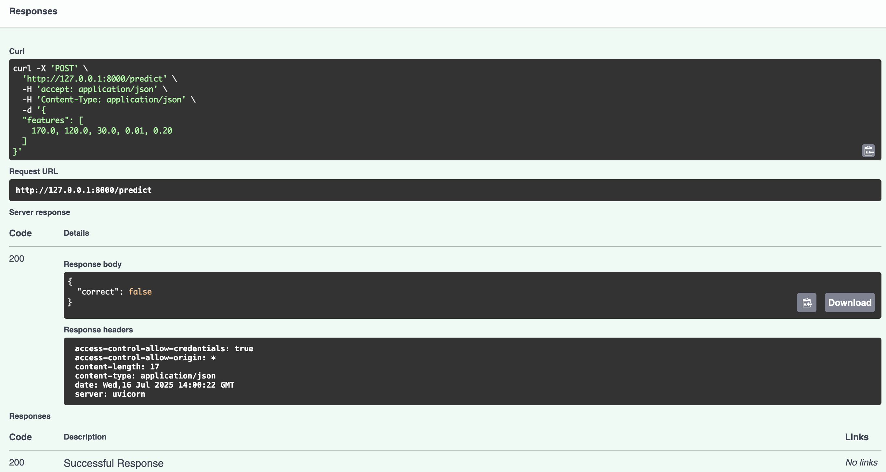
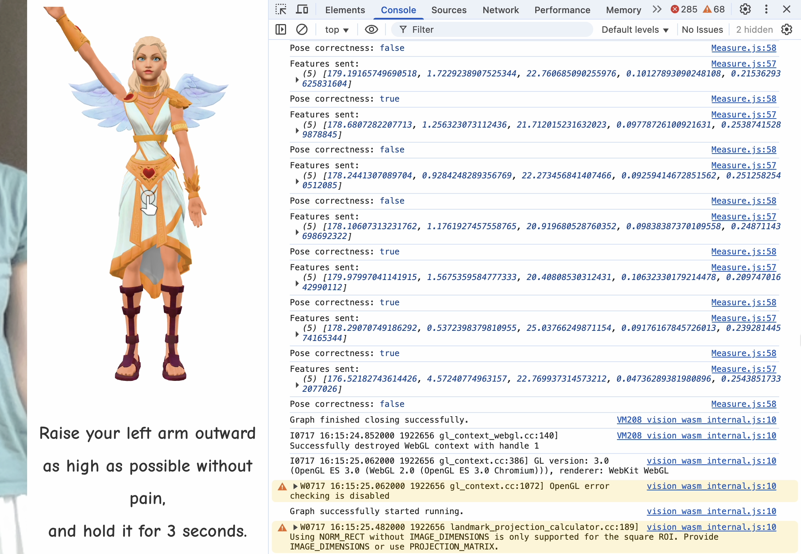

# FunMotion API

A simple FastAPI service that classifies shoulder abduction pose correctness based on 3D landmark features extracted from video. Used in conjunction with the [FunMotion web game](https://github.com/Chantilly0306/FunMotion).

## Overview

This API receives 5 pose-related features from a video frame:

- `elbow_angle`
- `shoulder_abd_angle`
- `angle_to_coronal_plane`
- `z_diff_elbow` (depth difference: shoulder vs elbow)
- `z_diff_wrist` (depth difference: shoulder vs wrist)

It returns whether the pose is **correct** or **incorrect** based on an SVM model trained on labeled rehab motion data.

